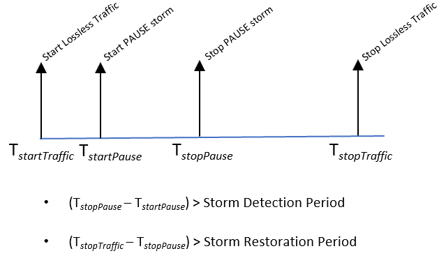

### Testbed
#### Topology 1
```
+-----------------+           +--------------+           +-----------------+       
| Keysight Port 1 |------ et1 |   SONiC DUT  | et2 ------| Keysight Port 2 | 
+-----------------+           +--------------+           +-----------------+ 
                                   et3
                                    |
                                    |
                                    |
                            +-----------------+
                            | Keysight Port 3 |
                            +-----------------+
```
*Fig. 1: Topology 1*

## 1.2. Setup configuration

### 1.2.1. DUT Configuration
•	PFC watchdog must be enabled in the DUT.
•	The DUT interfaces are configured as L3 interfaces with different IP subnet configured on different ports.


### Keysight configuration
•	All Keysight ports should have the same bandwidth capacity.

•	Test specific configurations are mentioned in respective test cases.

## Test Cases

### Test Case - PFCWD on Layer 3 ports

#### Test Objective

This test aims to verify how PFC watchdog can handle PFC storms on layer 3 DUT interfaces.

#### Test Topology

Refer to Topology 1.1.2.1 for the test topology.

#### Test Configuration

- On SONiC DUT configure the following:
  1. Configure IP address on the DUT ports, different subnet is configured on different ports.
  2. Enable watchdog with default storm detection time (400ms) and restoration time (2sec).
  3. Configure a single lossless priority value Pi (0 <= i <= 7).
  4. To minimize configuration complexity, it is recommended that the SONiC DUT be configured as either Top of Rack (ToR) or Tier 0 (T0) switch with three VLAN interfaces.

- Configure following traffic items on the Keysight device:
  1. Traffic 1<->2 : Bi-directional traffic between Keysight port 1 and port 2, with DSCP value mapped to lossless priority Pi configured in the DUT. Traffic Tx rate should be configured as 50% of line rate.
  2. Traffic 2<->3 : Bi-directional traffic between Keysight port 2 and port 3, with DSCP value mapped to lossless priority Pi configured in the DUT. Traffic Tx rate should be configured as 50% of line rate.
  3. PFC pause storm: Persistent PFC pause frames from Keysight
        port 3 to et3 of DUT. Priority of the PFC pause
        frames should be same as that configured in DUT and the
        inter-frame transmission interval should be lesser than
        per-frame pause duration.

#### Test Steps

Refer to the time diagram below to understand the work flow of the test case:



*Fig. 2: #Test 1 Workflow*

1. At time **_T<sub>startTraffic</sub>_** , start all the bi-directional lossless traffic items.
2. At time **_T<sub>startPause</sub>_** , start PFC pause storm.
3. At time **_T<sub>stopPause</sub>_** , stop PFC pause storm. (**_T<sub>stopPause</sub> - T<sub>startPause</sub>_**) should be larger than PFC storm detection time to trigger PFC watchdog.
4. At time **_T<sub>stopTraffic</sub>_** , stop lossless traffic items. Note that (**_T<sub>stopTraffic</sub> - T<sub>stopPause</sub>_**) should be larger than PFC storm restoration time to re-enable PFC.
5. Verify the following:
   * PFC watchdog is triggered on the corresponding lossless priorities at DUT interface et3. 
   * 'Traffic 1<->2' must not experience any packet loss in both directions. Its throughput should be close to 50% of the line rate.
   * For 'Traffic 2<->3', between **_T<sub>startPause</sub>_** and **_T<sub>stopPause</sub>_** , there should be almost 100% packet loss in both directions. 
   * After **_T<sub>stopPause</sub>_** , the traffic throughput should gradually increase and become 50% of line rate in both directions. 
   * There should not be any traffic loss after PFC storm restoration time has elapsed.
   * Keysight Port 1 and Keysight Port 2 must not receive any PFC pause packets during the test (either by DUT counters or packet capture at Keysight port 1/2).

6. Repeat the test for other lossless priorities.

